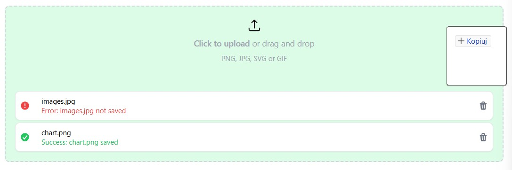

# react-files-input





## Features

- Drag & drop
- Click and browser files to upload
- Multiple files support
- Customizable API

## Installation

```sh
# with npm
npm i react-files-input
# with yarn
yarn add react-files-input
# with pnpm
pnpm add react-files-input
```

## Import

```tsx
import 'react-files-input/styles.css';
import { FileUploader } from 'react-files-input';
```

## Example 1 - mock upload

```tsx
import { FileUploader } from 'react-files-input';

const randomInt = (min: number, max: number) => Math.round(Math.random() * (max - min) + max);
const sleep = (ts: number) => new Promise(res => setTimeout(res, ts));

export default function App() {
  const onFileUpload = async (file: File): Promise<string> => {
    const timeToResolve = Math.random() * randomInt(1000, 3000);
    await sleep(timeToResolve);
    const success = Math.random() > 0.5;
    if (success) {
      return `Success: ${file.name} saved`;
    }
    throw `Error: ${file.name} not saved`;
  };

  return (
    <FileUploader
      maxFiles={3}
      fileTypes={['image/png', 'image/jpeg', 'image/svg', 'image/gif']}
      description="PNG, JPG, SVG or GIF"
      onFileUpload={onFileUpload}
    />
  );
}
```

## Example 2 - real life example

```tsx
import { useEffect, useRef } from 'react';
import { FileUploader } from 'react-files-input';

export default function App() {
  const abortCtrl = useRef<AbortController>();

  useEffect(() => {
    abortCtrl.current = new AbortController();
    return () => {
      abortCtrl.current?.abort();
    };
  }, []);

  const onFileUpload = async (file: File) => {
    const data = new FormData();
    data.append('file', file);

    const response = await fetch('/example', {
      method: 'POST',
      body: data,
      signal: abortCtrl.current?.signal
    });

    if (response.status >= 200 && response.status < 300) {
      return `Success: ${file.name} saved`;
    }
    throw `Error: ${file.name} not saved`;
  };

  const onFileDelete = async (file: File) => {
    await fetch(`/example/${file.name}`, {
      method: 'DELETE',
      signal: abortCtrl.current?.signal
    });
  };

  return (
    <FileUploader
      maxFiles={3}
      fileTypes={['image/png', 'image/jpeg', 'image/svg', 'image/gif']}
      description="PNG, JPG, SVG or GIF"
      onFileUpload={onFileUpload}
      onFileDelete={onFileDelete}
    />
  );
}
```

## Example 3 - inside form

```tsx
import { FileUploader } from 'react-files-input';

export default function App() {
  return (
    <form action="/action">
      <FileUploader inputName="files" />
    </form>
  );
};
```

## Example 4 - collect files without sending

```tsx
import { useState } from 'react';
import { FileUploader } from 'react-files-input';

export const CollectUpload = () => {
  const [files, setFiles] = useState<File[]>([]);

  const onFileUpload = async (file: File) => {
    setFiles(files => [...files, file]);
    return `Success: ${file.name} collected`;
  };

  const onFileDelete = async (file: File) => {
    setFiles(files.filter(item => item.name !== file.name));
  };

  const onCollect = () => {
    alert(`Files collected (${files.length})`);
  };

  return (
    <div>
      <FileUploader
        maxFiles={3}
        fileTypes={['image/png', 'image/jpeg', 'image/svg', 'image/gif']}
        description="PNG, JPG, SVG or GIF"
        onFileUpload={onFileUpload}
        onFileDelete={onFileDelete}
      />
      <button onClick={onCollect}>Collect</button>
    </div>
  );
};
```
