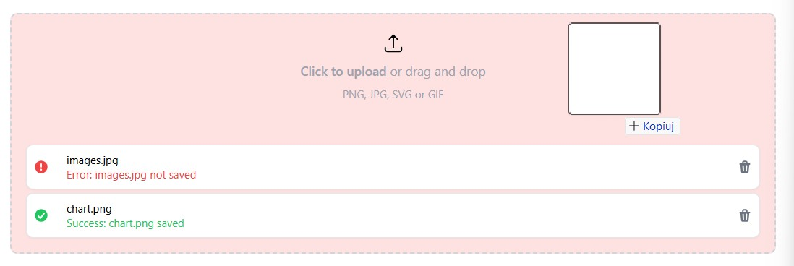

# React-files-uploader




## Features

- Drag & drop
- Click and browser files to upload
- Multiple files support
- Customizable API

## Installation

```sh
# Not yet available
```

## Example 1

```tsx
import { FileUploader } from '../lib';

const randomInt = (min: number, max: number) => Math.round(Math.random() * (max - min) + max);
const sleep = (ts: number) => new Promise(res => setTimeout(res, ts));

const onFileUpload = async (file: File, _: AbortController): Promise<string> => {
  const timeToResolve = Math.random() * randomInt(1000, 3000);
  await sleep(timeToResolve);
  const success = Math.random() > 0.5;
  if (success) {
    return `Success: ${file.name} saved`;
  }
  throw `Error: ${file.name} not saved`;
};

export default function App() {
  return (
    <FileUploader
      maxFiles={3}
      fileTypes={['image/png', 'image/jpeg', 'image/svg', 'image/gif']}
      description="PNG, JPG, SVG or GIF"
      onFileUpload={onFileUpload}
    />
  );
}
```

## Example 2

```tsx
import { useRef, useEffect, useCallback } from 'react';
import { FileUploader } from '../lib';

export default function App() {
  const abortControllerRef = useRef<AbortController>();
  const onFileUpload = useCallback(async (file: File, abortCtrl: AbortController) => {
    abortControllerRef.current = abortCtrl;

    const data = new FormData()
    data.append('file', file);

    const response = await fetch('/example', {
      method: 'POST',
      body: data
    });
    
    if (response.status >= 200 && response.status < 300) {
      return `Success: ${file.name} saved`;
    }
    throw `Error: ${file.name} not saved`;
  }, []);

  useEffect(() => {
    if (abortControllerRef.current) {
      abortControllerRef.current.abort();
    }
  }, []);

  return (
    <FileUploader
      maxFiles={3}
      fileTypes={['image/png', 'image/jpeg', 'image/svg', 'image/gif']}
      description="PNG, JPG, SVG or GIF"
      onFileUpload={onFileUpload}
    />
  );
}
```
